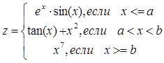
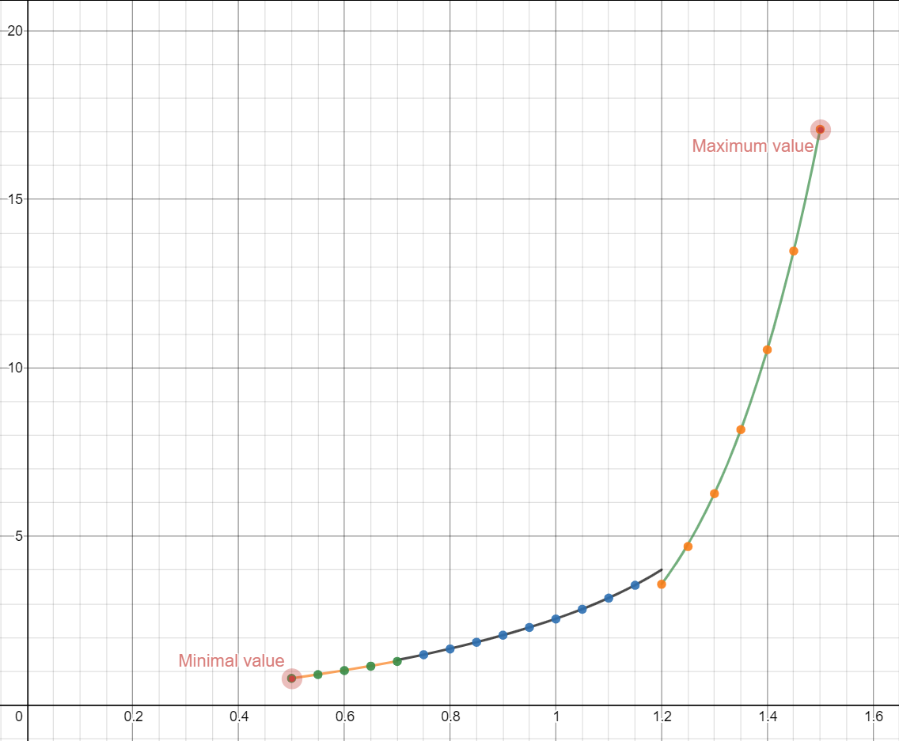

МИНИСТЕРСТВО НАУКИ И ВЫСШЕГО ОБРАЗОВАНИЯ РОССИЙСКОЙ ФЕДЕРАЦИИ  
Федеральное государственное автономное образовательное учреждение высшего образования  
"КРЫМСКИЙ ФЕДЕРАЛЬНЫЙ УНИВЕРСИТЕТ им. В. И. ВЕРНАДСКОГО"  
ФИЗИКО-ТЕХНИЧЕСКИЙ ИНСТИТУТ  
Кафедра компьютерной инженерии и моделирования
<br/><br/>

### Отчёт по лабораторной работе №2<br/> по дисциплине "Программирование"
<br/>

студента 1 курса группы ИВТ-б-0-192(2)
Менжелеев Александр Федорович
направления подготовки 09.03.01 "Информатика и вычислительная техника"  
<br/>

<table>
<tr><td>Научный руководитель<br/> старший преподаватель кафедры<br/> компьютерной инженерии и моделирования</td>
<td>(оценка)</td>
<td>Чабанов В.В.</td>
</tr>
</table>
<br/><br/>

Симферополь, 2019

<br/><br/>

# Табулирование кусочно-заданной функции

## Цель
- Овладеть практическими навыками разработки и программирования вычислительного процесса циклической структуры.
- Сформировать навыки программирования алгоритмов разветвляющейся структуры.
- Изучить операторы ветвления. Особенности использования полной и сокращенной формы оператора if и тернарного оператора.

## Постановка задачи

Напиcать на языке С++ программу которая для функции f(x) на интервале x ∈ [хнач; xкон]:
- выводит в консоль значения функции f(x) с шагом dx.
- определяет максимальное и минимальное значение функции.

## Практическая часть

Функция, выбранная для табуляции и построения графика, была выбрана в соответствии с вариантом 15 в списке журнала обучающихся.



*Рис. 1. Функция для табуляции*

### Исходный код программы

```cpp
#include <iostream>
#include <cmath>
#include <limits>

using namespace std;

bool isDobuleEqual(double x, double y, int accuracySigns = 5) {
	int intFract = fabs(x - y) * pow(10, accuracySigns);
	return intFract == 0;
}

struct Extrmemum {
	double x;
	double y;
};

int main()
{
	const double a = 0.7;
	const double b = 1.2;
	const double xInitial = 0.5;
	const double xEnd = 1.5;
	const double dx = 0.05;
	
	Extrmemum zMin{
		0, numeric_limits<double>::max()
	};

	Extrmemum zMax{
		0, numeric_limits<double>::min()
	};

	for (double currentX = xInitial; currentX < xEnd or isDobuleEqual(currentX, xEnd); currentX+=dx)
	{
		double currentZ;

		if (currentX < a or isDobuleEqual(currentX, a)) {
			currentZ = exp(currentX) * sin(currentX);
		}
		else if (currentX > a and currentX < b) {
			currentZ = tan(currentX) + (currentX * currentX);
		}
		else if (currentX > b or isDobuleEqual(currentX, b)) {
			currentZ = pow(currentX, 7);
		}

		if (currentZ < zMin.y) {
			zMin.y = currentZ;
			zMin.x = currentX;
		}

		if (currentZ > zMax.y) {
			zMax.y = currentZ;
			zMax.x = currentX;
		}


		std::cout << "Z: [" << currentZ << "]\tX: [" << currentX << "]\n" ;
	}

	std::cout << "\nMinimal Z: [" << zMin.x << ";" << zMin.y << "]\tMaximal Z: [" << zMax.x << ";" << zMax.y << "]\n";
}
```

### Таблица значений f(x)

|   x  |   y  |
| :-:  |  :-: |
| 0.50 | 0.79 |
| 0.55 | 0.90 |
| 0.60 | 1.02  |
| 0.65 | 1.15 |
| 0.70 | 1.29 |
| 0.75 | 1.49 |
| 0.80 | 1.66 |
| 0.85 | 1.86 |
| 0.90 | 2.07 |
| 0.95 | 2.30 |
| 1.00 | 2.55 |
| 1.05 | 2.84 |
| 1.10 | 3.17 |
| 1.15 | 3.55 |
| 1.20 | 3.58 |
| 1.25 | 4.76 |
| 1.30 | 6.27 |
| 1.35 | 8.17 |
| 1.40 | 10.54 |
| 1.45 | 13.47 |
| 1.50 | 17.08 |

### График функции



*Рис. 2. График функции.*

## Вывод

В ходе проделанной работы были получены навыки математических вычислений с применением программирования.<br>
Получены навыки создания программ с условным ветвлением и навыки создания циклических алгоритмов.<br>
Приобретены знания о работе сервисов для построения графиков и отработаны на практике.
