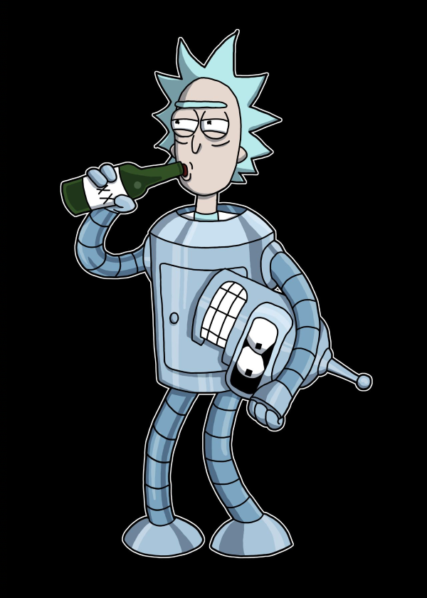

МИНИСТЕРСТВО НАУКИ И ВЫСШЕГО ОБРАЗОВАНИЯ РОССИЙСКОЙ ФЕДЕРАЦИИ  
Федеральное государственное автономное образовательное учреждение высшего образования  
"КРЫМСКИЙ ФЕДЕРАЛЬНЫЙ УНИВЕРСИТЕТ им. В. И. ВЕРНАДСКОГО"  
ФИЗИКО-ТЕХНИЧЕСКИЙ ИНСТИТУТ  
Кафедра компьютерной инженерии и моделирования
<br/><br/>

### Отчёт по лабораторной работе №3<br/> по дисциплине "Программирование"
<br/>

студента 1 курса группы ИВТ-б-0-192(2)
Менжелеев Александр Федорович
направления подготовки 09.03.01 "Информатика и вычислительная техника"  
<br/>

<table>
<tr><td>Научный руководитель<br/> старший преподаватель кафедры<br/> компьютерной инженерии и моделирования</td>
<td>(оценка)</td>
<td>Чабанов В.В.</td>
</tr>
</table>
<br/><br/>

Симферополь, 2019

<br/><br/>

# Дешифровка текста из изображения

## Цель
- Закрепить навыки разработки программ использующих операторы цикла;
- Закрепить навыки разработки программ использующих массивы;
- Освоить методы подключения сторонних библиотек.

## Задача

Написать на языке С++ программу, которая по заданному изображению и ключу восстанавливает исходное текстовое сообщение (Си-строка) зашифрованное в изображении.

## Практическая часть

Для работы с изображениями формата bmp была загружена и размещена в папке `'libs'` библиотека, указанная в методических рекомендациях.<br>

В качестве исходного изображения для расшифровки взята картинка под номером 15 в соответствии с присвоенным номером варианта.<br>



*Рис 1. Исходное изображение.*

Ключ, используемый для расшифровки исходного сообщения:

```
00g 00b 00r 01g 01b 01r 10g 10b
```

### Исходный код программы

```cpp
#include <iostream>
#include <bitset>
#include <vector>
#include <string>
#include "lib/libbmp.h"

using namespace std;

typedef bitset<8> byte_t;
typedef byte_t char_t;

typedef bool bit_t;

struct Pixel {
	long int x;
	long int y;
};

enum COLORID {
	GREEN,
	BLUE,
	RED
};

bit_t getColorBit(BmpImg image, Pixel point, COLORID &colorId) {
	byte_t convertByte;
	switch (colorId)
	{
	case RED:
		convertByte = image.red_at(point.x, point.y);
		break;
	case GREEN:
		convertByte = image.green_at(point.x, point.y);
		break;
	case BLUE:
		convertByte = image.blue_at(point.x, point.y);
		break;
	}

	if (colorId == 2)
		colorId = static_cast<COLORID>(0);
	else
		colorId = static_cast<COLORID>(colorId + 1);

	return convertByte[0];
}

bit_t countNullByte(bit_t pipe, short &counter){
	if (pipe == 0)
		++counter;
	else
		counter = 0;

	if (counter == 8)
		throw exception();
	return pipe;
}

int main()
{
	BmpImg Image;
	if (Image.read("source.bmp") != BMP_OK)
		return EXIT_FAILURE;

	const long int imageHeight = Image.get_width();
	const long int imageWidth = Image.get_width();


	COLORID colorCounter = static_cast<COLORID>(0);

	short int nullByteCounter = 0;

	vector<bit_t> bitsVector;

	cout << "Wait until end. It may take long long time...\n";

	try {

		for (long int horizontalCounter = 0; horizontalCounter < imageWidth; horizontalCounter++)
		{
			for (long int verticalCounter = 0; verticalCounter < imageHeight; verticalCounter++) {
				Pixel currentPixel{
					horizontalCounter,
					verticalCounter
				};
				bitsVector.push_back(
					countNullByte(
						getColorBit(Image, currentPixel, colorCounter),
						nullByteCounter
					)
				);
				bitsVector.push_back(
					countNullByte(
						getColorBit(Image, currentPixel, colorCounter),
						nullByteCounter
					)
				);
				bitsVector.push_back(
					countNullByte(
						getColorBit(Image, currentPixel, colorCounter),
						nullByteCounter
					)
				);
			}
		}
	}
	catch (exception e) {}

	std::string decryptedText;

	const long int bitsCount = bitsVector.size();

	short int counter = 0;

	char_t nextChar;
	
	for (long unsigned int i = 0; i < bitsCount - 6; i++)
	{
		if (counter == 8) {
			counter = 0;
			decryptedText += (char)nextChar.to_ulong();
		}
		nextChar.set(7 - counter, bitsVector[i]);
		counter++;
	}
	decryptedText += (char)nextChar.to_ulong();

	cout << endl << decryptedText << endl << endl;

	std::system("pause");
}
```

### Исходный текст

```
Abraham Lincoln  February 12, 1809 Ц April 15, 1865) was an American statesman and lawyer who served as the 16th president of the United States from March 1861 until his assassination in April 1865. Lincoln led the nation thr political crisis.[3][4] He preserved the Union, abolished slavery, strengthened the federal government, and modernized the U.S. economy.
Born in a log cabin, Lincoln grew up on the frontier (mainly in Spencer County, Indianaegislator and U.S. Congressman from Illinois. In 1849, he left government to resume his law practice, but angered by the KansasЦNebraska Act's opening of the prairie lands to slavery, reentered politics in 1854. He became a lt national Democratic leader Stephen Douglas in the U.S Senate campaign in Illinois. He then ran for President in 1860, sweeping the North and winning. Southern pro-slavery elements took his win as proof that the North was rerocess of seceding from the union. To secure its independence, the new Confederate States of America fired on Fort Sumter, one of the few U.S. forts in the South. Lincoln called up volunteers and militia to suppress the rebel Lincoln confronted Radical Republicans, who demanded harsher treatment of the South; War Democrats, who rallied a large faction of former opponents into his camp; anti-war Democrats (called Copperheads), who despised him; an by pitting them against each other, by carefully distributing political patronage, and by appealing to the American people.[5]:65Ц87 His Gettysburg Address became an iconic call for nationalism, republicanism, equal rights,  defusing the Trent Affair. Lincoln closely supervised the war effort, including the selection of generals and the naval blockade that shut down the South's trade. As the war progressed, he maneuvered to end slavery, issuing aging border states to outlaw slavery, and pushing through Congress the Thirteenth Amendment to the United States Constitution, which outlawed slavery across the country.
Lincoln managed his own re-election campaign. He sough days after the Battle of Appomattox Court House, he was shot by John Wilkes Booth, an actor and Confederate sympathizer, on April 14, 1865, and died the following day. Abraham Lincoln is remembered as the United States' marttest U.S. presidents.
```

## Вывод

В ходе проделанной работы были получены навыки работы с внешними библиотеками.<br>
Проведен анализ исходного кода библиотеки для работы с bmp изображениями.<br>
Отработаны навыки создания циклических алогоритмов, создания функций.<br>
Получены знания о библиотеках для работы с битами.<br>
