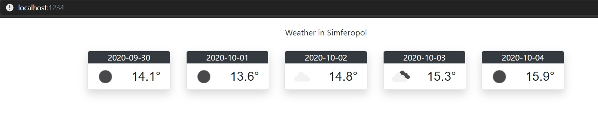

МИНИСТЕРСТВО НАУКИ И ВЫСШЕГО ОБРАЗОВАНИЯ РОССИЙСКОЙ ФЕДЕРАЦИИ  
Федеральное государственное автономное образовательное учреждение высшего образования  
"КРЫМСКИЙ ФЕДЕРАЛЬНЫЙ УНИВЕРСИТЕТ им. В. И. ВЕРНАДСКОГО"  
ФИЗИКО-ТЕХНИЧЕСКИЙ ИНСТИТУТ  
Кафедра компьютерной инженерии и моделирования
<br/><br/>

### Отчёт по лабораторной работе №6<br/> по дисциплине "Программирование"
<br/>

студента 1 курса группы ИВТ-192
Менжелеев Александр Федорович
направления подготовки 09.03.01 "Информатика и вычислительная техника"  
<br/>

<table>
<tr><td>Научный руководитель<br/> старший преподаватель кафедры<br/> компьютерной инженерии и моделирования</td>
<td>(оценка)</td>
<td>Чабанов В.В.</td>
</tr>
</table>
<br/><br/>

Симферополь, 2019

<br/><br/>

# Погодный информер

## Цель:
- Закрепить навыки разработки многофайловыx приложений
- Изучить способы работы с API web-сервиса
- Изучить процесс сериализации/десериализации данных

## Ход работы

### API Key

Ключ для доступа к данным API OpenWeather.

`4febc999265e8cc8bd6bbaca851c1f89`

### Исходный код

```cpp

#include <iostream>
#include <string>
#include <vector>
#include <fstream>
#include <exception>
#include "include/httplib.h"
#include "include/json.hpp"

using namespace httplib;
using namespace nlohmann;

const std::string APIDOMAIN = R"(api.openweathermap.org)";
const std::string APIPATH = R"(/data/2.5/forecast?q=Simferopol&appid=4febc999265e8cc8bd6bbaca851c1f89&units=metric)";
const std::string TEMPLATE_FILE_PATH = "./source/Weather.html";

std::string stdTemplate;

Client fetchClient(APIDOMAIN.c_str());

std::string prettifyDouble(double x, short offset){
    std::string str = std::to_string(x);
    return str.substr(0, str.find(".") + offset);
}

std::string replace(std::string base, std::string what, std::string to){
    size_t index = base.find(what);

    if (index != std::string::npos)
        base = base.replace(index, what.length(), to);

    return base;
}

std::string replaceAll(std::string base, std::vector<std::pair<std::string, std::string>> toReplace) {
    for (auto it : toReplace) {
        base = replace(base, it.first, it.second);
    }
    
    return base;
}


json getLastWeather() {
     auto res = fetchClient.Get(APIPATH.c_str());

     if (res->status != 200)
         throw new std::runtime_error("Can't resolve api host");

     return json::parse(res->body)["list"];
}


void requestHandler(const Request& req, Response& res){

    json lastWeather = getLastWeather();

    std::vector<std::pair<std::string, std::string>> replaces = {
        std::make_pair("{city.name}", "Simferopol")
    };

    for (size_t i = 0; i < 40; i+=8)
    {
        replaces.push_back(std::make_pair(
            "{list.dt}", lastWeather[i]["dt_txt"].get<std::string>().substr(0, 10)
        ));
        replaces.push_back(std::make_pair(
            "{list.weather.icon}", lastWeather[i]["weather"][0]["icon"]
        ));
        replaces.push_back(std::make_pair(
            "{list.main.temp}", prettifyDouble(lastWeather[i]["main"]["temp"].get<double>(), 2)
        ));
    }
   
    res.set_content(replaceAll(stdTemplate, replaces), "text/html");
}


int main()
{
    std::ifstream templateFile(TEMPLATE_FILE_PATH);
    templateFile.open(TEMPLATE_FILE_PATH);

    if (!templateFile.is_open())
        return EXIT_FAILURE;

    std::stringstream buffer;
    buffer << templateFile.rdbuf();
    stdTemplate = buffer.str();

    Server server;
    server.Get("/", requestHandler);
    server.listen("localhost", 1234);

    return EXIT_SUCCESS;
}
```

### Демонстрация работы программы



*Рис. 1. Демонстрация работы виджета.*

## Вывод

В ходе проделанной работы были получены знания о работе протокола HTTP.  
Получены навыки работы с API, обработкой формата данных JSON.  
Получены и отработаны на практике знания о создании приложений, работающих с файловыми операциями.  
Получены навыки создания web приложений.