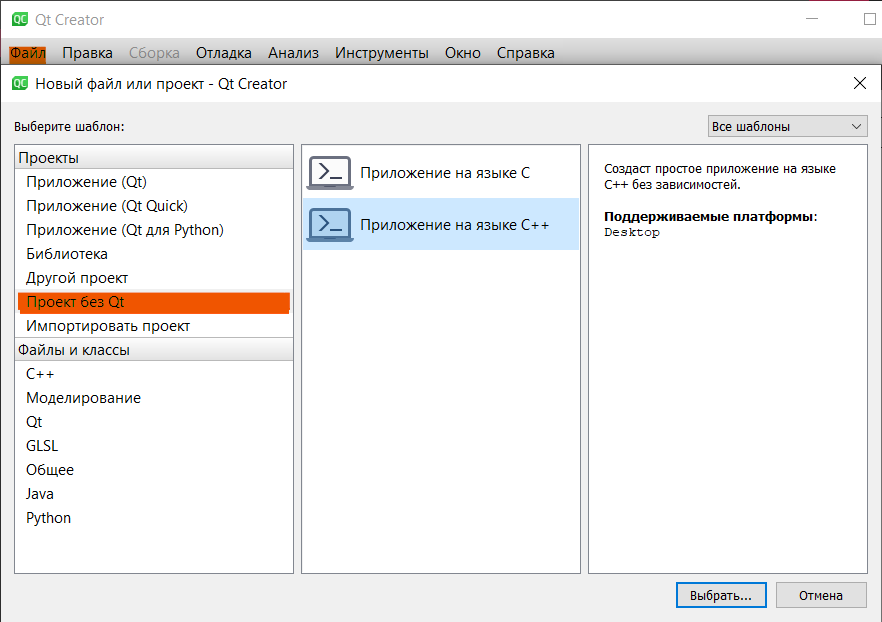
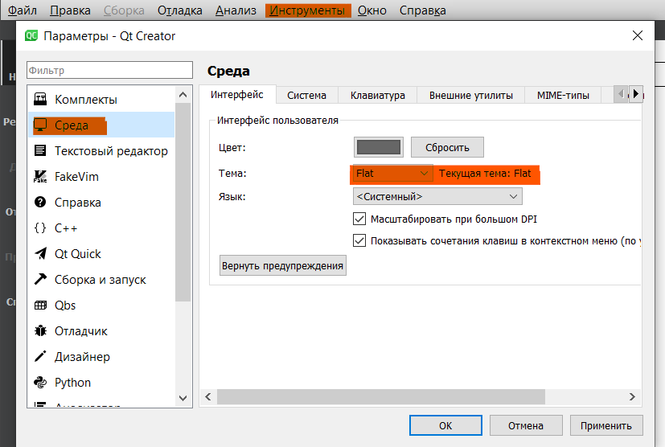
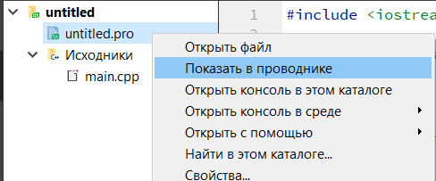
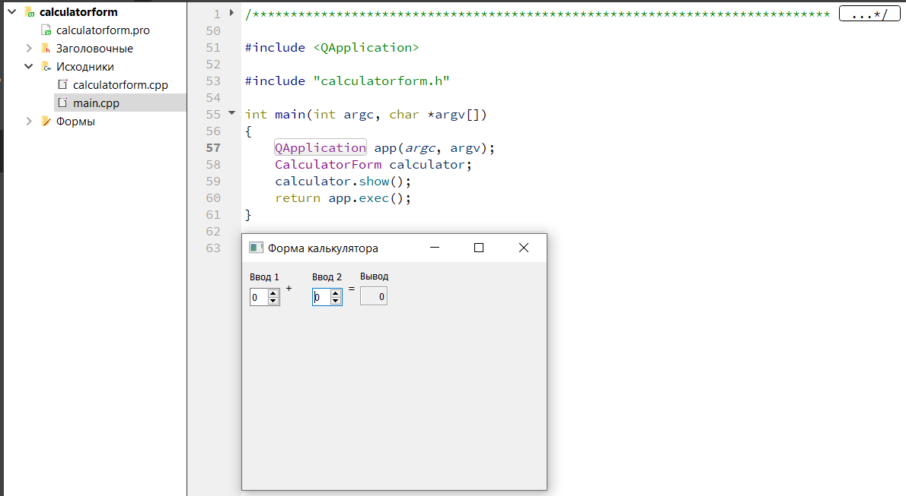
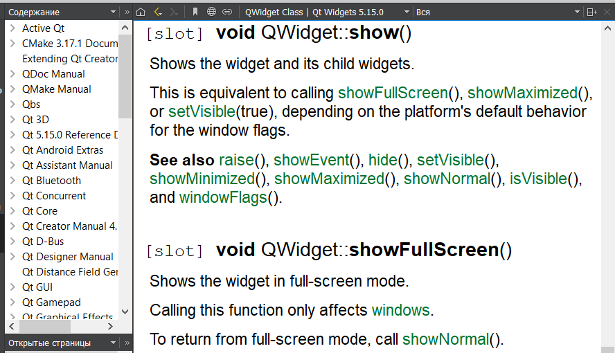
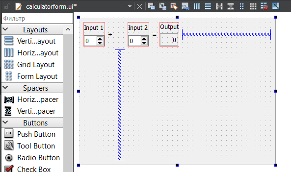

МИНИСТЕРСТВО НАУКИ И ВЫСШЕГО ОБРАЗОВАНИЯ РОССИЙСКОЙ ФЕДЕРАЦИИ  
Федеральное государственное автономное образовательное учреждение высшего образования  
"КРЫМСКИЙ ФЕДЕРАЛЬНЫЙ УНИВЕРСИТЕТ им. В. И. ВЕРНАДСКОГО"  
ФИЗИКО-ТЕХНИЧЕСКИЙ ИНСТИТУТ  
Кафедра компьютерной инженерии и моделирования
  

### Отчёт по лабораторной работе №7  по дисциплине "Программирование"
 

студента 1 курса группы ИВТ-192
Менжелеев Александр Федорович
направления подготовки 09.03.01 "Информатика и вычислительная техника"  
 

<table>
<tr><td>Научный руководитель  старший преподаватель кафедры  компьютерной инженерии и моделирования</td>
<td>(оценка)</td>
<td>Чабанов В.В.</td>
</tr>
</table>
  

Симферополь, 2019

  

# Настройка Qt Creator для разработки приложений под android

## Цель:
Изучить основные возможности создания и отладки программ в IDE Qt Creator.

## Ход работы

### №1

`Файл - Проект без QT`

*Рис 1. Создание проекта*

### №2

`Инструменты - Среда - Интерфейс - Тема`

*Рис 2. Смена темы.*

### №3

`Правка - Дополнительно - Закомментировать / Раскоментировать`

**ИЛИ**

`Ctrl + /`

### №4

*Рис 3. Смена темы.*

### №5

Для хранения информации об проекте используется файлы с расширением `.pro`.

### №6

Код без отладки запускается треугольником без "жучка" и сочетанием клавиш Ctrl + R.

### №7

Запуск кода в режиме отладки запускатся при помощи зеленого треугольника с "жучком" или `Отладка - Начать отладку`.

### №8

Брейкпоинт устанавливается кликом мыши слева от нумерации строк или клавишей `F9`.

### №9

Значение переменной I в 5 строке: `5`

Значение переменных D в 6 строке: `8.7454837e-317`

Значение переменных I & D в 7 строке: `i: 5; d: 5`

Совпадают ли значения: `Значения отличаются от MVS`

### №10,11,12,13,14

В результате открытия проекта-калькулятора и его запуска, появилось окно-форма приложения.

*Рис. 4. Форма приложения калькулятора.*

### №15

В результате нажатия кнопки была получена справка по методу Show класса QWidget.

*Рис. 5. Справка по методу.*

### №16, 17

При помощи визуального интерфейса редактировани форм, изменим тайтлы для инпутов в свойствах каждого объекта.

*Рис. 6. Переведенный интерфейс.*

